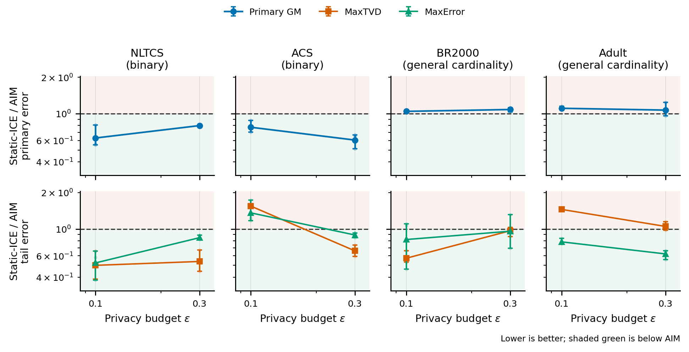

# SAGE-QDTE-ICE WP10a 结果与下一步专家决策问题

Date: 2026-07-15

## 0. 当前拍板

WP10a 已按预注册协议完成。精确 full-reconstructable-query-L2 分配在
Adult、epsilon `0.1`、seed `0` 上确实降低了公开闭式 measurement risk，
也小幅改善了最终 MAE/RMSE，但没有通过冻结 utility gate，并造成明显的
MaxError 退化。

```text
decision: freeze_workload_l2_allocation
```

本地不继续扩 seed、epsilon 或数据集，也不根据这次 true utility 反向调整
family weight、tail guard、tree score、entropy 或 shrinkage。WP10a 应作为：

> 公开 L2 measurement-risk 改善不能自动保证 heterogeneous evaluator 和
> pointwise tail utility 改善的又一个 transfer diagnostic。

## 1. 冻结协议与机制完整性

```text
protocol:  SAGE-QDTE-ICE-WP10A-WORKLOAD-ALLOCATION-20260715-v1
candidate: SAGE-QDTE-Static-ICE-WorkloadL2-v1
dataset:   Adult
epsilon:   0.1
seed:      0
adjacency: unbounded / add_remove
```

唯一变化是公开 rho 分配：

```text
control:   cell-reference public_optimal
candidate: full-reconstructable-query-L2 public_optimal
```

以下全部保持相同：total rho、strategy blocks、measurement RNG、每个
coefficient 的 standard-normal draw、initial table、generation seed、exact
precision operator、5000 iterations、每轮 4096 candidates 和 canonical
evaluator。

封存前机制 gate 全部通过：

```text
rho spent == rho declared
control transcript bytewise reproduced
coupled standard-normal max error: 4.88e-15
initial-table hash matched
exact precision active
5000 / 5000 iterations
20.48 million candidates scored
incremental answer drift == 0
true utility not evaluated during generation
```

封存 artifact 的 14 个记录均通过 SHA-256 复核。

## 2. 公开风险证书

Adult 完整 workload 共 `28,654` 个 queries，其中 `22,534` 个 order <= 2
queries 可由当前 orthogonal strategy 精确重构；`6,120` 个高阶 queries
不参与该闭式分配目标。

```text
cell-reference identity max relative error: 6.91e-14
optimal/current public L2 risk:             0.8455718532
current pair rho share:                     0.9197821438
candidate pair rho share:                   0.8465777443
```

也就是说，candidate 对它声明的公开目标给出了精确的 `15.44%` 风险降低，
实现和公式没有失效。

## 3. 冻结 utility 结果

| Metric | Control | Candidate | Candidate / Control |
| --- | ---: | ---: | ---: |
| MAE | 0.00211627 | 0.00206272 | **0.974694** |
| RMSE | 0.00520235 | 0.00505309 | **0.971309** |
| AvgTVD | 0.08028343 | 0.08152675 | 1.015487 |
| MaxTVD | 0.34642431 | 0.34752996 | 1.003192 |
| MaxError | 0.06819690 | 0.09269824 | **1.359274** |

Primary composite 是 MAE/RMSE/AvgTVD ratio 的几何平均：

```text
primary composite: 0.986961
required:          <= 0.970000   fail

each primary:      <= 1.05       pass
each tail:         <= 1.15       fail (MaxError)
```

因此不能因为 MAE/RMSE 小幅改善而把该 allocator 升级或继续扩展。

## 4. 我们对失败原因的当前判断

这不是 QDTE 没有跑满，也不是 public allocation 实现错误。更准确的结论是：

1. **风险目标仍不等于 evaluator。** 闭式分配最小化的是可重构 queries 的
   等权总 L2 variance；AvgTVD 是 partition-level L1 聚合，MaxError 是
   pointwise L-infinity endpoint。
2. **分配改变存在真实平均收益。** MAE/RMSE 同向改善约 `2.5%/2.9%`，说明
   public workload information 不是无效的，只是收益不足且不安全。
3. **tail 代价不能隐藏。** pair rho share 从 `92.0%` 降到 `84.7%`，同时
   MaxError 增大 `35.9%`。目前只能称为相关现象；在定位具体 query family
   前不能断言唯一因果，更不能用 true tail 反向调权重。
4. **WP9 的 cardinality split 仍未解决。** WP10a 只针对 Adult 有非平凡
   public-L2 改动，却没有把 Adult 推过 promotion gate；它不能成为
   general-cardinality rescue。

## 5. 现在希望专家拍板一个核心问题

请先只回答 Q1 的二选一。Q2--Q4 不是并列的新方向；只有选择 Q1-B、继续
general-cardinality 路线时，才需要把它们作为该单一新机制的完整
specification。这样可以避免同时授权多个模糊 variant。

### Q1. 是否停止把 ICE 追成统一 broad default？

已有独立 gate 的结果是：P3/covariance、shrinkage、entropy、cycles、private
OI selector、coverage refinement 和现在的 full-workload-L2 allocation 均未
升级；WP9 又显示 ICE 只稳定赢 binary datasets。

请拍板二选一：

```text
A. 冻结 ICE 为 binary/low-cardinality profile，当前论文回到 QDTE 主线；
B. 继续 general-cardinality 路线，但必须指定一个新的、可预声明且可证伪的
   单一数学机制，而不是把多个已失败 arm 直接拼接。
```

### Q2. 若选择 Q1-B，下一风险对象究竟应是什么？

目前仅剩两个 public/released-only 候选，但都缺唯一数学定义：

```text
equal-public-group / block-normalized risk:
  Adult public risk ratio 0.670850
  BR2000 public risk ratio 0.655962
  但 estimand 与 primary evaluator 的关系尚未证明。

released sparse-tree prior:
  total-excess 与 null-standardized trees 的 edge overlap 仅约 0.08--0.17，
  高 cardinality edge 的维数校准没有唯一答案。
```

若推荐其中之一，请给出精确 objective、公开输入、dimension normalization、
可证明的 risk/utility surrogate 和一次性 gate。否则本地不应任选一种开跑。

### Q3. 若选择 Q1-B，MaxError tail 是否存在不依赖 truth 的可证明保护？

我们不接受根据本次 top true-error query 设计 guard。请判断是否存在只用
public workload metadata 与 released transcript 的机制，例如预声明的
L2/L-infinity mixed design、per-block variance cap 或 convex risk constraint，
并明确它保护的是 measurement risk、projected target 还是 final synthetic
utility。若没有 final-utility guarantee，也请明确应把 MaxError 作为不可统一
优化的独立 tradeoff 报告。

### Q4. 若选择 Q1-B，是否有理由授权一次“联合 ICE”实验？

专家完整方案强调 interaction measurement、shrinkage、P3/covariance、entropy
和 cycles 的协同，但我们的隔离实验大多为负。若认为隔离失败不能排除联合
协同，请给出：

```text
唯一冻结 composition
为什么存在互补而不是负效应叠加的数学论证
不依赖 Adult true utility 的全部超参数
最小 causal controls
一次性 promotion gate
```

没有这些条件，本地默认不把多个 rejected arms 组合成一个难以归因的新方法。

## 6. 等待专家期间已完成的本地工作

研究 variant 已暂停扩展；以下不依赖新方法拍板的工作已经完成：

```text
公开 artifact 与 review guide 闭环                         complete
DP fail-closed schema/n assertions                          complete
duplicate-qid 与 actual-spend ledger assertions             complete
single-edit / aggregate-batch exactness audit tests          complete
私有测量进程与 public-transcript generation 进程物理分离     complete
Base 与 Static-ICE exact-precision transcript 等价测试       complete
冻结 WP9 图表输入与 binary/general-cardinality 可视化         complete
```

两进程路径已在真实 NLTCS strong config 上验证：`8,704` queries、`138`
measurement groups 的三份 public payload、initial table 和 final table 均与
旧一体化路径 SHA-256 相同。包含新增 Static-ICE exact-precision transcript
test 与冻结图表测试在内，完整测试为 `867 passed, 3 skipped`。已有 WP9/WP10a
seal 未改动。

下面的冻结图直接显示为什么总体 `0.866260` 不能被写成 broad-default
胜利：两个 binary datasets 的 primary 明显低于 AIM；BR2000/Adult 位于或
高于 AIM，ACS epsilon `0.1` 和 Adult 的 MaxTVD 还有独立 tail tradeoff。



## 7. Evidence

```text
protocol:
  docs/SAGE_QDTE_ICE_WP10A_WORKLOAD_ALLOCATION_PROTOCOL_20260715.md

no-truth seal:
  outputs/static_ice_wp10a_workload_l2_formal_20260715/sealed_manifest.json

offline gate:
  outputs/static_ice_wp10a_workload_l2_eval_20260715/gate_summary.json

public-route diagnostic:
  docs/SAGE_QDTE_ICE_WP9A_PUBLIC_ROUTE_DIAGNOSTIC_RESULT_20260715.md

broad WP9 confirmation:
  docs/SAGE_QDTE_ICE_WP9_RESULT_AND_NEXT_EXPERT_QUESTIONS_20260715.md

frozen visual summary and ratio table:
  outputs/static_ice_wp9_figures_20260715/figure_manifest.json
  outputs/static_ice_wp9_figures_20260715/wp9_static_ice_vs_aim_gate.pdf
  outputs/static_ice_wp9_figures_20260715/wp9_static_ice_vs_aim_ratios.csv
```
